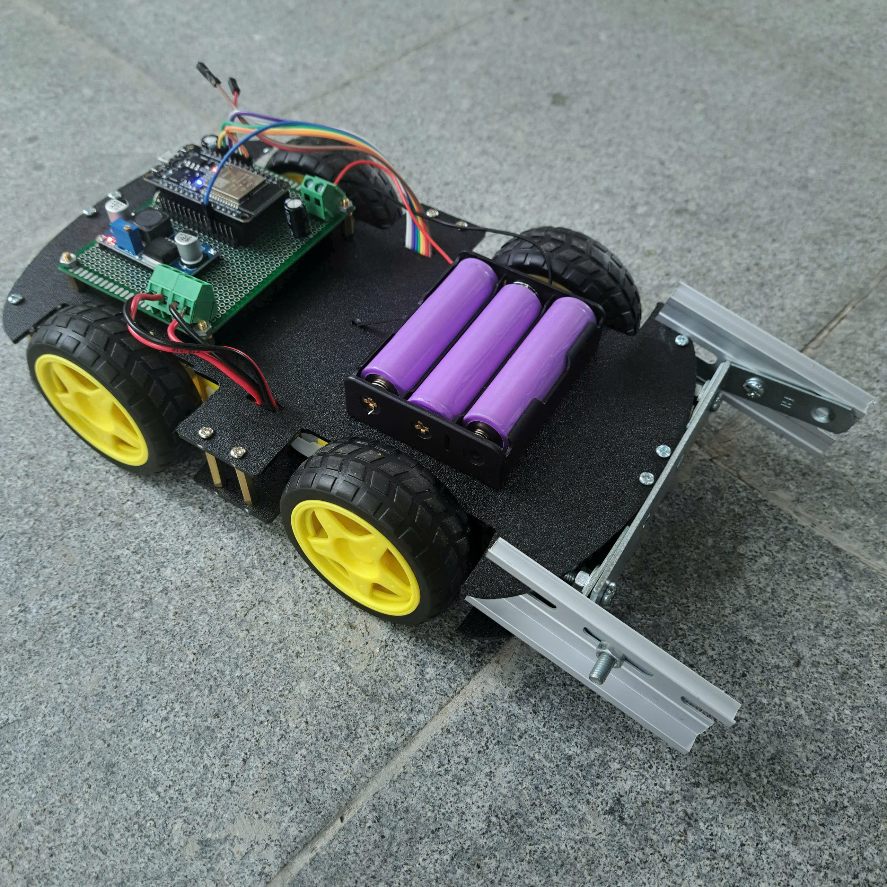

# ESP32 Bluetooth-Controlled 4WD Robot Car

A 4WD robot car developed for the **LAUNCHTIME 9TH competition**, organized by the Faculty of Electrical and Electronics Engineering, Ho Chi Minh City University of Technology.



## Overview

The project is an ESP32-based 4WD robot car controlled remotely via Bluetooth from a smartphone. The system uses the **BT Car Controller** application to send movement commands to the ESP32, which parses the received data and controls four DC motors through two TB6612 motor drivers.

The car supports **eight-direction movement** and variable-speed control using the ESP32's hardware PWM (LEDC).

## Features

- Bluetooth remote control via smartphone
- Eight-direction movement:
  - Forward
  - Backward
  - Left
  - Right
  - Forward-left
  - Forward-right
  - Backward-left
  - Backward-right
- Variable-speed control
- PWM-based motor speed control using ESP32 LEDC
- 4WD drive system with four DC motors
- Command parsing through Bluetooth Serial
- Differential speed control between the left and right sides

## Hardware

| Component | Quantity | Description |
|---|---:|---|
| ESP32 NodeMCU LuaNode32 Module | 1 | Main microcontroller and Bluetooth interface |
| DC Motor | 4 | 4WD drive system |
| TB6612 Motor Driver | 2 | Dual-channel motor drivers |
| Buck Converter | 1 | Voltage regulation |
| 18650 Battery Cell | 3 | Series-connected power source |

### Motor Configuration

The four DC motors are arranged as:

- 2 motors on the left side
- 2 motors on the right side

Each side is controlled as a group, allowing differential drive control for forward/backward motion and turning.

## Software & Technologies

- **Microcontroller:** ESP32
- **Programming Language:** C/C++ with Arduino framework
- **Bluetooth:** Bluetooth Classic using `BluetoothSerial`
- **Motor Control:** PWM using ESP32 LEDC
- **PWM Frequency:** 1 kHz
- **PWM Resolution:** 8-bit
- **Bluetooth Controller:** BT Car Controller

## Bluetooth Communication

The ESP32 initializes Bluetooth Serial with the device name:

```text
Xe_ESP32
```

The smartphone communicates with the ESP32 through Bluetooth. The received data is buffered character by character and processed when a line-ending character (`\n` or `\r`) is received.

### Command Format

The control data uses the following format:

```text
F50R30
```

Where:

- `F50` represents forward motion with a speed value of `50`
- `R30` represents a right-turn component with a value of `30`

Similarly:

- `F` → Forward
- `B` → Backward
- `L` → Left
- `R` → Right

The numeric values are mapped from `0–99` to the PWM range `0–255`.

## Motor Control Logic

The received command is first separated into two components:

- **Forward component:** controls the overall forward/backward motion
- **Turn component:** controls the speed difference between the left and right sides

For forward motion:

```text
Left Speed  = Forward + Turn
Right Speed = Forward - Turn
```

For backward motion:

```text
Left Speed  = Forward - Turn
Right Speed = Forward + Turn
```

The resulting motor speeds are scaled to prevent either side from exceeding the maximum PWM value.

The system also applies a lower speed limit during in-place rotation.

## Pin Configuration

| Function | ESP32 GPIO |
|---|---:|
| TB6612 STBY | GPIO 21 |
| Motor Left IN1 | GPIO 12 |
| Motor Left IN2 | GPIO 13 |
| Motor Right IN3 | GPIO 14 |
| Motor Right IN4 | GPIO 27 |
| Motor Left PWM (ENA) | GPIO 25 |
| Motor Right PWM (ENB) | GPIO 26 |
| On-board LED | GPIO 2 |

### PWM Channels

| Channel | GPIO | Frequency | Resolution |
|---|---:|---:|---:|
| LEDC Channel 0 | GPIO 25 | 1 kHz | 8-bit |
| LEDC Channel 1 | GPIO 26 | 1 kHz | 8-bit |

## Software Structure

The current implementation is organized in a single Arduino sketch:

```text
ControlCar/
└── ControlCar.ino
```

The main software components include:

- Bluetooth initialization and data reception
- Character-based command buffering
- Command parsing
- Forward/turn speed mixing
- PWM speed control
- Motor direction control

### Main Functions

```text
setup()
loop()
processData()
driveMotor()
```

- `setup()` initializes Bluetooth, GPIOs, the motor drivers, and PWM channels.
- `loop()` continuously receives and buffers Bluetooth data.
- `processData()` parses movement commands and calculates the required left/right motor speeds.
- `driveMotor()` controls motor direction and PWM duty cycle.

## Power System

The robot is powered by **three 18650 battery cells connected in series**. A buck converter is used as part of the power system to provide the required regulated voltage.

## Competition

This project was developed as a competition project for:

**LAUNCHTIME 9TH**  
Faculty of Electrical and Electronics Engineering  
Ho Chi Minh City University of Technology

## Team

| Member | Role |
|---|---|
| Lê Quang Tín | Team Leader |
| Trần Đức Tin | Team Member |
| Phạm Viết Nhật Huy | Team Member |

## Author

**Lê Quang Tín** — Team Leader
